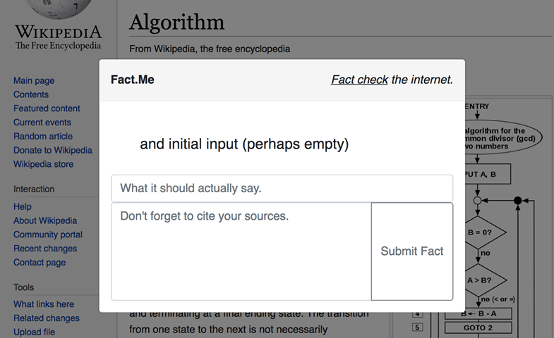

# factme
Crowd-sourced fact checker for the world wide web.

## About factme
Users of this chrome extension are able to flag fake news on any website, and cite a corrective source. Other users will see these changes and can up or downvote them accordingly.

## Implications
This extension democratizes information on the web to an extent by providing a easy-to-use framework for fact-checking. We hope this tool can give all users perspective and insight into the information that they see and interact with online.

## Future Directions
When a fact reaches a certain threshold of upvotes, it will then be automatically substituted into the original text of the page (users can still see the original by mousing over). Users will be able to gain credibility (the more high-upvote facts a user has posted, the more credible their fact-checking). This extension has the potential of providing a very interesting long-term dataset about internet honesty and veracity.